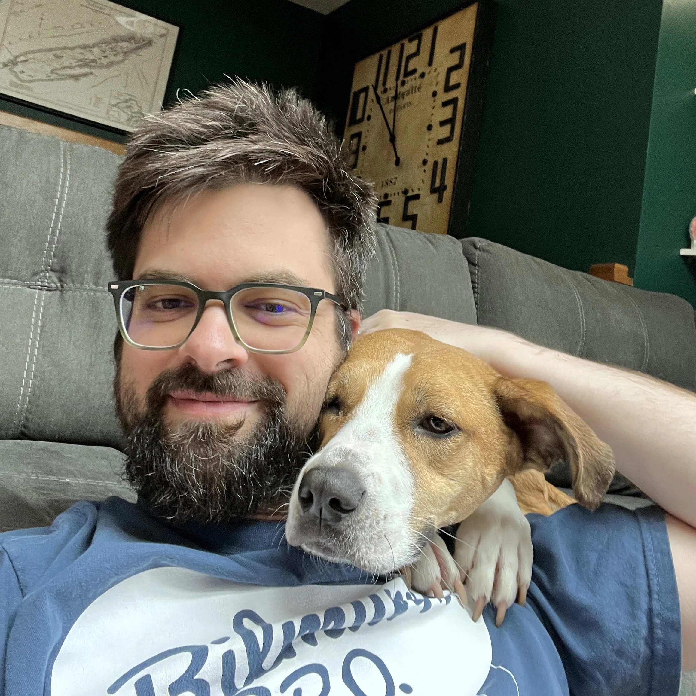
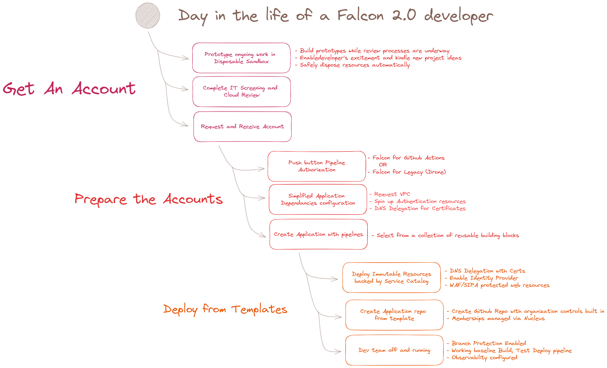
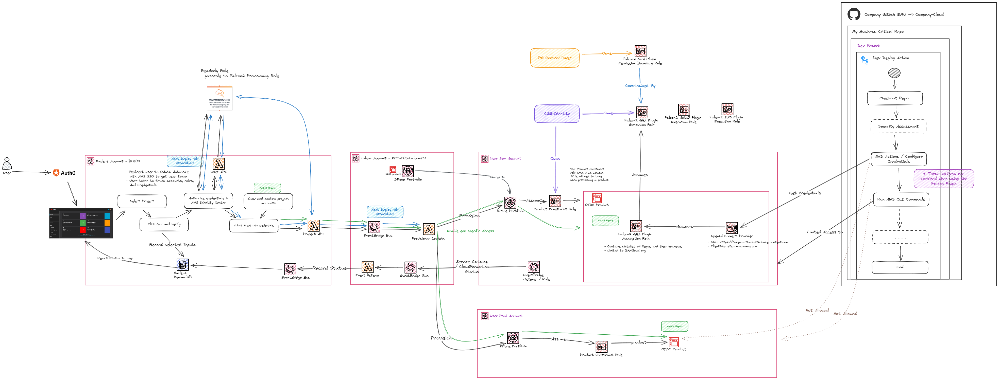

# About me

Phone: (989) 429-6968  
Email: garverkr@gmail.com

*I have lots of ideas - they just can't all be bangers.*

## Hi There!

{ align=left width="350" }

Frankly, my intention with this page is to serve as a catalyst for a conversation.

Finding and building solutions through automation to help others focus on things they care about is what gets me exited. I'm passionate about empowering others and ensuring that my solutions are accessible. Through small increments, I get feedback early and apply that to the next iteration.  I'm not afraid to try something and throw it out if it isn't the right solution.  They can't all be bangers after all.

## Projects / What have I been up to

Currently, I'm the Lead Senior Software Engineer in the Developer Services group for 3M Platform Engineering.  

*Ok, but what does that actually mean?*

In practicality, I wear the hat best fit for the task. Some days I'm neck deep writing code for our next feature, others days I'm architecting the visions for the next generation of tooling for 3M's software teams.  I lead a diverse team to make those visions a reality, and more recently finding ways for those individuals to reach their professional goals.  All while applying the company's values, as well as my own.  

- Everyone can and should write code.
- Cast users into the pit of success.
- Use the right tool for the job.

Most recently I've been working to remove friction and accelerate developer teams in 3M.  Each project required that I quickly ramp up on new tools and technologies to then apply them.  The basic patten I follow is to setup a proof of concept, design the product architecture, build the breakdown of stories to be completed, and finally divvy out and guide a team to complete the work.  In 2023 that involved three main solutions:  

- Prototype, architect, and own the next generation of DevOps practices used by dozens of development teams. 
- Lead and contribute to a library of reusable, compliant by default, cloud constructs. 
- Automate and accelerate adoption of security tooling and make it as easy as possible for identified vulnerabilities to be connected with the developers best equipped to address them.

But none of this work was done in a vacuum or by myself.  Today, I serve as the technical leader of a team of seven developers, each at a different point in their career.  A few of them have been in the industry for 15+ years each.  I often seek them out for "sniff tests" to make sure the bits we are solutioning for aren't complete shit. We recently had an individual join our team in the middle of a career change who is new to software development. Their grit to learn everyday is inspirational, and their journey is a great test of my conviction that anyone can code and the tools we create should be intuitive as possible. Outside of my immediate team, I work with my direct manager and other leaders to mesh our priorities with theirs. This means frequently having challenging conversations to reevaluate the status quo and push for modern solutions.

## Tools and other bits
These are the tools I use frequently use but certainly is not an exhaustive list. 

**Cloud providers**

:simple-amazonaws: AWS  
:material-microsoft-azure: Azure
---

**DevOps:**

:simple-amazonaws: AWS Cloud Developer Kit / AWS Cloud Formation  
:simple-githubactions: Github Actions - SAS Automation tooling  
:simple-drone: Drone CI - Docker based Automation pipeline  
:material-wizard-hat: Wiz.io - Cloud Vulnerability Risk management hub 
---

**Languages**

:simple-csharp: C# / .NET  
:simple-typescript: TypeScript / Javascript  
:simple-python: Python
---

**Dev Tools**

:simple-docker: Dev Containers - Ask me about these.  
:simple-githubactions: Github Actions  
:simple-githubcopilot: Github Copilot  
:simple-jirasoftware: Jira  
:simple-obsidian: Obsidian  
:simple-materialformkdocs: MKdocs  
:material-drawing: Excalidraw
---

**Web Frameworks:**

:simple-react: React   
:material-vuejs: Vue  
:simple-blazor: Blazor
---

**Databases**

:simple-microsoftsqlserver: MS SQL Server - Sql Database  
:simple-amazondynamodb: DynamoDb - NoSql Database  
:material-graph: Neptune Graph DB
---

**Certifications**
AWS Certified Cloud Practitioner
---

**Some visuals I'm proud of, that showcase some ways I like to breakdown and communicate information.**

{ loading=lazy }

{ loading=lazy }

## My goals

A goal I have set for myself is to be in a position to make an impact. I get my kicks on solving problems. Nothing gets me more jazzed then when I can see how some solution I created or had a part of makes their life better. 

Other more concrete goals are to obtain my Certified Information Systems Security Professional (CISSP) and Certified Cloud Security Professional (CSSP) Certifications. These will help to demonstrate the knowledge I've built from years in the industry while also finding the gaps in my knowledge.  

## Personal life

I live White Bear Lake, Minnesota with my wife (Lindsay), two cats (Mendel, Ruby), and dog (Zero). I'm originally from Clare, MI and went to college at Central Michigan University. There I earned my undergrad in Business Information Systems with a minor in IT, landed an internship at 3M, and a job offer. 

In my free time I enjoy video games with my childhood friends, now strewn across the country, and more recently I've taken up game development as a creative outlet.  Less frequently than I'd like, I enjoy back packing and the yearly dirt bike trip to Michigan's Upper Peninsula with my father.  Finally, with what ever time I have left, I am working on house projects.  Because there are always house projects to be done. 

{ align=right width="350" loading=lazy }
{ align=left width="350" loading=lazy }
